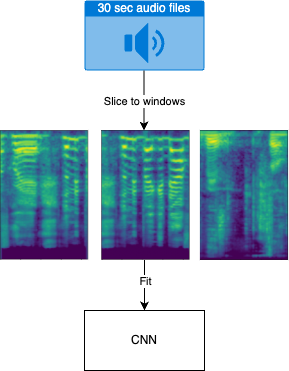
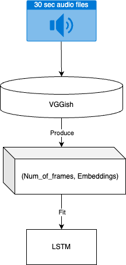

# Rap-Speech-Classification
## Overview
Many studies have leveraged the harmonic patterns in music to achieve high accuracy on music/speech classification. However, the rap genre, with its vocal style closely resembling spoken words, blurs these lines with its speech-like qualities. This project will investigate the efficacy of 4 existing *pre-trained models + LSTM* and 1 *CNN+FC (fully connected layers)* in discriminating between rap vocals and speech. 

Our data is self-collected audio data of speech and rap vocals, which are scrapped from youtube via [`yt-dlp`](https://github.com/yt-dlp/yt-dlp), followed by [`Demucs (htdemucs_ft version)`](https://github.com/facebookresearch/demucs) for separating target vocals from music tracks.

## Dataset
This project uses self-collected data. The **Ultimate_Rap_Dataset_Cleaned** has 207 rap songs with a total of 48109 sec ≈ 13.36 hr; The **Ultimate_Speech_Dataset_Cleaned** has 172 speech audio files with a total of 76362 sec ≈ 21.21 hr. 

### Data collection
The Data preparation, data pre-processing, and data cleaning are time-concuming. After having our audio data with JSON files downloaded, we perform vocal separation to extract rap vocals as well as speech from their music tracks. Followed by removing and replacing problematic characters, ensuring compatibility across different systems and software, and preventing errors, we formed our **Ultimate** datasets.

- #### Rap
> A comprehensive list of rap music was curated to ensure a diverse and representative dataset, it included a wide range of rap music from its late 1970s to contemporary innovations. Besides, conscious effort was made to incorporate more songs by female rappers to achieve a more balanced gender distribution.

- #### Speech
> We specifically target speech audio that contains background music, applying `Demucs` for speech separation to maintain consistency between isolated rap vocals and isolated speech in our dataset.

## Models
We compare 5 models on this task: 

  

    
(1) CNN+FC

    
  

  
  

    
(2) YAMnet+LSTM

    
  

  
  

    
(3) VGGish+LSTM

    
  

  
  

    
(4) OpenL3+LSTM

    
  

  
  

    
(5) PANNs+LSTM

    
  

