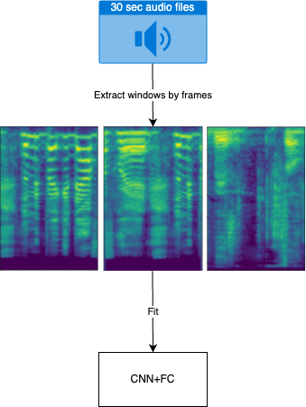

# Rap Vocals and Speech Classifier
## Overview
Many studies have leveraged the harmonic patterns in music to achieve high accuracy on music/speech classification. However, the rap genre, with its vocal style closely resembling spoken words, blurs these lines with its speech-like qualities. This project will investigate the efficacy of 4 existing *pre-trained models + LSTM* and 1 *CNN+FC (fully connected layers)* in discriminating between rap vocals and speech. 

Our data is self-collected audio data of speech and rap vocals, which are scrapped from youtube via [`yt-dlp`](https://github.com/yt-dlp/yt-dlp), followed by [`Demucs (htdemucs_ft version)`](https://github.com/facebookresearch/demucs) for separating target vocals from music tracks.

## Dataset
This project uses self-collected data. The **Ultimate_Rap_Dataset_Cleaned** has 207 rap songs with a total of 48109 sec ≈ 13.36 hr; The **Ultimate_Speech_Dataset_Cleaned** has 172 speech audio files with a total of 76362 sec ≈ 21.21 hr. 

### Data collection
The Data preparation, data pre-processing, and data cleaning are time-concuming. After having our audio data with JSON files downloaded, we perform vocal separation to extract rap vocals as well as speech from their music tracks. Followed by removing and replacing problematic characters, ensuring compatibility across different systems and software, and preventing errors, we formed our **Ultimate** datasets.

- #### Rap
> A comprehensive list of rap music was curated to ensure a diverse and representative dataset, it included a wide range of rap music from its late 1970s to contemporary innovations. Besides, conscious effort was made to incorporate more songs by female rappers to achieve a more balanced gender distribution.

- #### Speech
> We specifically target speech audio that contains background music, applying `Demucs` for speech separation to maintain consistency between isolated rap vocals and isolated speech in our dataset.

## Models
We compare 5 models on this task: 

<details style="text-align: center; margin: 20px;">
    <summary>&emsp; (1) CNN+FC</summary>
    
</details>

<details style="text-align: center; margin: 20px;">
    <summary>&emsp; (2) YAMnet+LSTM</summary>
    
</details>

<details style="text-align: center; margin: 20px;">
    <summary>&emsp; (3) VGGish+LSTM</summary>
    
</details>

<details style="text-align: center; margin: 20px;">
    <summary>&emsp; (4) OpenL3+LSTM</summary>
    
</details>

<details style="text-align: center; margin: 20px;">
    <summary>&emsp; (5) PANNs+LSTM</summary>
    
</details>

## How to use this repository
### Requirements
If using conda:
```
conda env create -f environment.yml
```
If using pip:
```
pip install -r requirements.txt
```
### Run the Notebook Cells
To effectively progress through the model training process, it is crucial to run the cells in your Jupyter notebook sequentially. Each cell in the notebook builds upon the previous ones, from data loading and preprocessing to the final stages of model training. Here are some important points to keep in mind:
- Data Reshaping: Different pre-trained models require input tensors of different shapes. Pay attention to the reshaping steps in the notebook to ensure that your data conforms to the required dimensions for each model.
- Variable and File Names: In the notebook, variables that store temporary data might have the same names as the .np or .npz files where data is saved. While they share names, their contents at any given point could be different due to ongoing data processing steps.
- Saving and Loading Data:
Throughout the notebook, data is frequently saved to and loaded from .np (NumPy arrays) or .npz (compressed NumPy array archives) files. Make sure to modify to your path.

### Demo
See how my demo identify 3 raw rap vocals.

## Referencess
- [`yt-dlp` usage instructions](https://github.com/yt-dlp/yt-dlp#readme)

- [TensorFlow Models: VGGish](https://github.com/tensorflow/models/tree/master/research/audioset/vggish)

- [TensorFlow Models: YAMNet](https://github.com/tensorflow/models/tree/master/research/audioset/yamnet)

- [Hybrid Transformers for Music Source Separation.](https://github.com/facebookresearch/demucs)<br/>
Rouard, S., Massa, F., & Défossez, A. (2023). <br/>
IEEE Int. Conf. on Acoustics, Speech and Signal Processing (ICASSP) (pp. 1-5). 

- [Look, Listen and Learn More: Design Choices for Deep Audio Embeddings](http://www.justinsalamon.com/uploads/4/3/9/4/4394963/cramer\_looklistenlearnmore\_icassp\_2019.pdf)<br/>
Aurora Cramer, Ho-Hsiang Wu, Justin Salamon, and Juan Pablo Bello.<br/>
IEEE Int. Conf. on Acoustics, Speech and Signal Processing (ICASSP), pages 3852–3856, Brighton, UK, May 2019.

- [Look, Listen and Learn](http://openaccess.thecvf.com/content\_ICCV\_2017/papers/Arandjelovic\_Look\_Listen\_and\_ICCV\_2017\_paper.pdf)<br/>
Relja Arandjelović and Andrew Zisserman.<br/>
IEEE International Conference on Computer Vision (ICCV), Venice, Italy, Oct. 2017.

- [Panns: Large-scale pretrained audio neural networks for audio pattern recognition.](https://github.com/qiuqiangkong/audioset_tagging_cnn) <br/>
Qiuqiang Kong, Yin Cao, Turab Iqbal, Yuxuan Wang, Wenwu Wang, and Mark D. Plumbley.<br/>
IEEE/ACM Transactions on Audio, Speech, and Language Processing 28 (2020): 2880-2894.